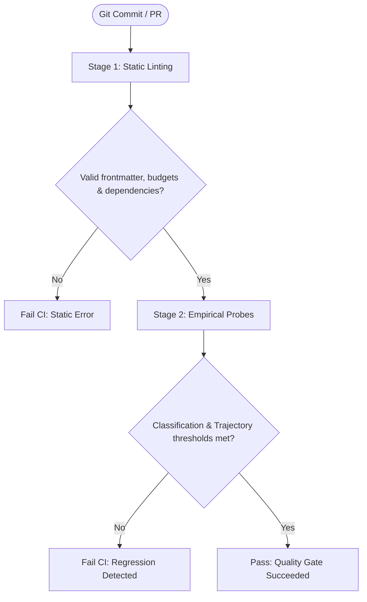

# `reach check`

Execute a two-stage CI/CD quality gate combining static linting with empirical regression assertions.

`reach check` is the recommended command for pull request validation and pre-merge CI checks.

---

## Two-Stage Architecture



1. **Stage 1 (static)**: Fast, offline schema, budget, dependency, and lockfile validation across modified skills without API calls.
2. **Stage 2 (empirical)**: Probes modified skills against their rivals using a fixed query set, validating classification accuracy, misrouting, and multi-step trajectory metrics (entrypoint accuracy, reachability, step efficiency, skill F1, and redundancy).

> [!WARNING]
> **CI/CD Runner Safety**
> Stage 2 empirical probes execute live agent tools on the runner. For automated CI/CD pipelines (GitHub Actions, Cloud Build), ensure workflows run inside isolated runner containers or sandboxes (e.g. [Google Cloud Run sandboxes](../guides/sandboxing.md)), and pass `--yes` (or set `REACH_YES=1`) to prevent non-interactive fail-closed termination.

---

## Synopsis

```bash
reach check [SKILLS] [OPTIONS]
```

---

## Key Scenarios

/// tab | Check only changed skills in a PR
Limit validation to skills changed relative to the merge base:

```bash
reach check --changed --since origin/main
```

///

/// tab | Enforce classification thresholds
Require specific recall and misroute targets:

```bash
reach check ./skills --queries ./queries.json --min-recall 0.80 --max-misroute 0.10
```

///

/// tab | Enforce multi-step trajectory thresholds
Validate multi-turn agent execution against trajectory thresholds:

```bash
reach check ./skills \
  --queries ./queries.json \
  --min-entrypoint 0.80 \
  --min-reachability 0.90 \
  --min-efficiency 0.80 \
  --min-f1 0.85 \
  --max-redundancy 0.25
```

Output:

```text
────────────────────────── Reach Quality Gate: PASSED ──────────────────────────

Stage 1 (Static Pre-flight): ✓ PASS
  • 58 skill(s) inspected, 0 error(s), 0 warning(s).

Stage 2 (Empirical Quality Gate): ✓ PASS
  • 12 query(ies) evaluated across 12 probe(s) (budget: 50).
╭─────────────────────────┬──────────┬──────────┬────────╮
│ Metric                  │ Observed │   Target │ Status │
├─────────────────────────┼──────────┼──────────┼────────┤
│ recall                  │   100.0% │ >= 80.0% │  PASS  │
│ accuracy                │   100.0% │ >= 80.0% │  PASS  │
│ misroute_rate           │     0.0% │ <= 10.0% │  PASS  │
│ entrypoint_accuracy     │    91.7% │ >= 80.0% │  PASS  │
│ trajectory_reachability │    95.0% │ >= 90.0% │  PASS  │
│ step_efficiency         │    88.5% │ >= 80.0% │  PASS  │
│ skill_f1                │    92.0% │ >= 85.0% │  PASS  │
│ redundancy              │     0.08 │  <= 0.25 │  PASS  │
╰─────────────────────────┴──────────┴──────────┴────────╯
```

///

/// tab | Audit local skills against Google Cloud Agent Registry
Compare local workspace skill descriptions against remote Agent Registry definitions:

```bash
reach check --project your-project-id --location global
```

Output:

```text
────────────────────── Agent Registry Audit: your-project-id (global) ──────────────────────
╭───────────────────────┬──────────────┬─────────────────┬─────────────────────────────────╮
│ Skill                 │ Local Status │ Registry Status │ Audit Finding                   │
├───────────────────────┼──────────────┼─────────────────┼─────────────────────────────────┤
│ cloud-logging         │   Resident   │     ACTIVE      │ ✓ In sync                       │
│ cloud-monitoring      │   Resident   │     ACTIVE      │ ⚠ Description modified locally  │
│ vertex-ai-search      │   Resident   │     Missing     │ + New local skill (unregistered)│
│ bigquery-insights     │    Absent    │     ACTIVE      │ • Remote registry skill         │
╰───────────────────────┴──────────────┴─────────────────┴─────────────────────────────────╯

Summary: 1 in sync, 1 modified, 1 new local, 1 remote-only (4 total).
```

///

/// tab | GitHub Actions workflow step
Emit GitHub workflow annotations and write a GitHub Flavored Markdown summary to `$GITHUB_STEP_SUMMARY`:

```bash
reach check --format github --step-summary
```

///

---

## Options

### Classification & Discovery Options

| Option                     | Type               | Default           | Description                                                                                                          |
| :------------------------- | :----------------- | :---------------- | :------------------------------------------------------------------------------------------------------------------- |
| `[SKILLS]`, `--skills`     | Path               | Auto-discovered   | Path to skill directory, `SKILL.md` file, or catalog tree (discovered from precedence if omitted).                   |
| `--queries`                | Path               | -                 | Path to labeled evaluation queries JSON file for Stage 2 empirical evaluation.                                       |
| `--changed`                | Flag               | `false`           | Scope check to skills modified relative to git base reference.                                                       |
| `--since`                  | String             | `HEAD~1`          | Git reference to compare against for `--changed`.                                                                    |
| `--strict` / `--no-strict` | Flag               | `true`            | Fail with exit code 1 if static lint warnings are detected.                                                          |
| `--min-recall`             | Float `[0.0, 1.0]` | `0.80`            | Minimum acceptable target recall threshold.                                                                          |
| `--min-accuracy`           | Float `[0.0, 1.0]` | `0.80`            | Minimum acceptable classification accuracy threshold.                                                                |
| `--max-misroute`           | Float `[0.0, 1.0]` | `0.10`            | Maximum acceptable misroute rate threshold.                                                                          |
| `--budget`                 | Integer `>= 1`     | `50`              | Maximum empirical probes permitted across the check run.                                                             |
| `--agent`                  | Choice             | `from reach.toml` | Agent runtime for empirical probing (`claude-code`, `antigravity-cli`, `antigravity-sdk`, `goose`, `keyword`, `pi`). |
| `--filter-skill`           | String             | None              | Filter empirical check to target skill name(s) (glob pattern, repeatable).                                           |
| `--filter-id`              | String             | None              | Filter empirical check to query ID(s) (glob pattern, repeatable).                                                    |

### Agent Registry Options

| Option            | Type   | Default    | Description                                                               |
| :---------------- | :----- | :--------- | :------------------------------------------------------------------------ |
| `--project`, `-p` | String | None       | Google Cloud project ID hosting the Agent Registry.                       |
| `--location`      | String | `"global"` | Agent Registry location endpoint (`global`, `us`, `eu`).                  |
| `--publisher`     | String | None       | Filter registry skills by publisher identifier (e.g. `cloud.google.com`). |
| `--registry`      | Flag   | `false`    | Explicitly target Google Cloud Agent Registry instead of local workspace. |
| `--fresh`         | Flag   | `false`    | Bypass cached metadata and re-fetch latest skill definitions.             |
| `--no-cache`      | Flag   | `false`    | Run without reading or writing local disk cache.                          |

### Multi-Step Trajectory Options

| Option               | Type               | Default | Description                                                    |
| :------------------- | :----------------- | :------ | :------------------------------------------------------------- |
| `--min-entrypoint`   | Float `[0.0, 1.0]` | None    | Minimum acceptable entrypoint accuracy threshold.              |
| `--min-reachability` | Float `[0.0, 1.0]` | None    | Minimum acceptable trajectory reachability threshold.          |
| `--min-efficiency`   | Float `[0.0, 1.0]` | None    | Minimum acceptable step efficiency (MRR) threshold.            |
| `--min-f1`           | Float `[0.0, 1.0]` | None    | Minimum acceptable skill selection F1 threshold.               |
| `--max-redundancy`   | Float `>= 0.0`     | None    | Maximum acceptable trajectory redundancy (excess invocations). |

### Output & Configuration Options

| Option           | Type   | Default                    | Description                                                        |
| :--------------- | :----- | :------------------------- | :----------------------------------------------------------------- |
| `--global`, `-g` | Flag   | `false`                    | Discover and inspect skills from user global configuration (`~/`). |
| `--quiet`, `-q`  | Flag   | `false`                    | Suppress standard terminal view.                                   |
| `--format`       | Choice | `auto`                     | Output format: `auto`, `concise`, `github`, `json`, `text`.        |
| `--step-summary` | Flag   | `true` (in GitHub Actions) | Write GFM Markdown scorecard to `$GITHUB_STEP_SUMMARY`.            |
| `--yes`, `-y`    | Flag   | `false`                    | Bypass interactive safety confirmation prompts.                    |
| `--ignore`       | String | -                          | Disable specific lint rule(s) (repeatable).                        |
| `--error`        | String | -                          | Treat specific lint rule(s) as error (repeatable).                 |
| `--warn`         | String | -                          | Treat specific lint rule(s) as warning (repeatable).               |
| `--config`, `-c` | Path   | -                          | Path to `reach.toml` configuration file.                           |
